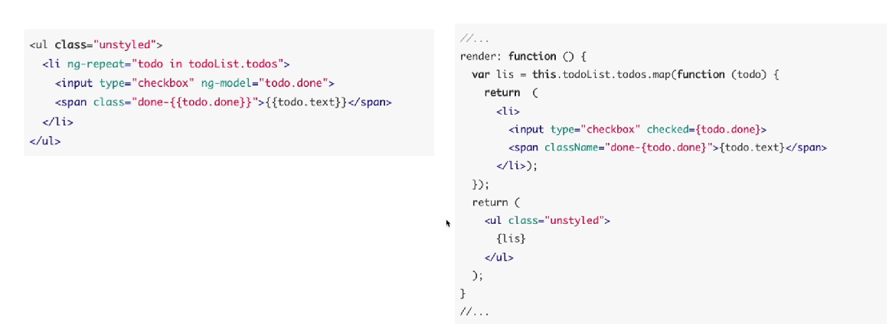

React 设计思想及优势

1、站在巨人肩膀上看成功的原因
2、看看目前的 React 整合的技术，以及实现
3、理解 React,并爱上使用 React

前端演进

1、最初的静态页面-》ajax->JQuery
2、需要简化代码、提高可维护性-》设计模式-》MVC
3、工程化-》模块化：Angular2、Vue、React

React 设计哲学---简洁之美

1、单向数据流（数据页面绑定、单向渲染-》UI=f(x))}
2、虚拟 DOM(学习快照的思想)
3、组件化（一致性、方便协作）

1、可预测：编写可预测、符合开发者习惯的代码
2、简化模型：JSX、界面更新、单向数据流
3、衍生：React Native->一次学习、多次书写

vue 常用指令，掌握起来花心思

反观 2016 年 6 月核心作者谈 React

1、变换、抽象、组合、状态、缓存
2、列表、连续性、状态映射、
